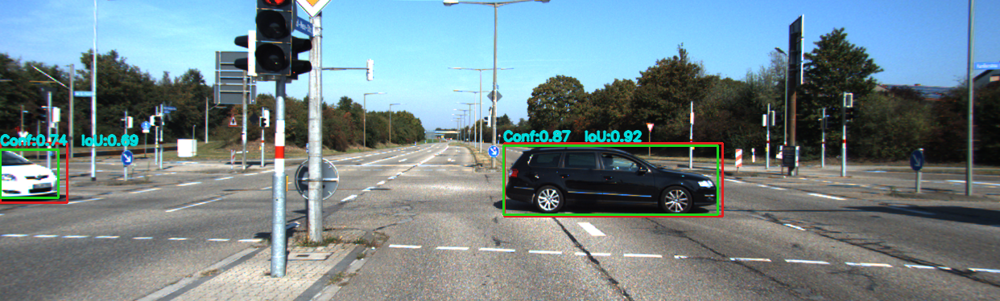
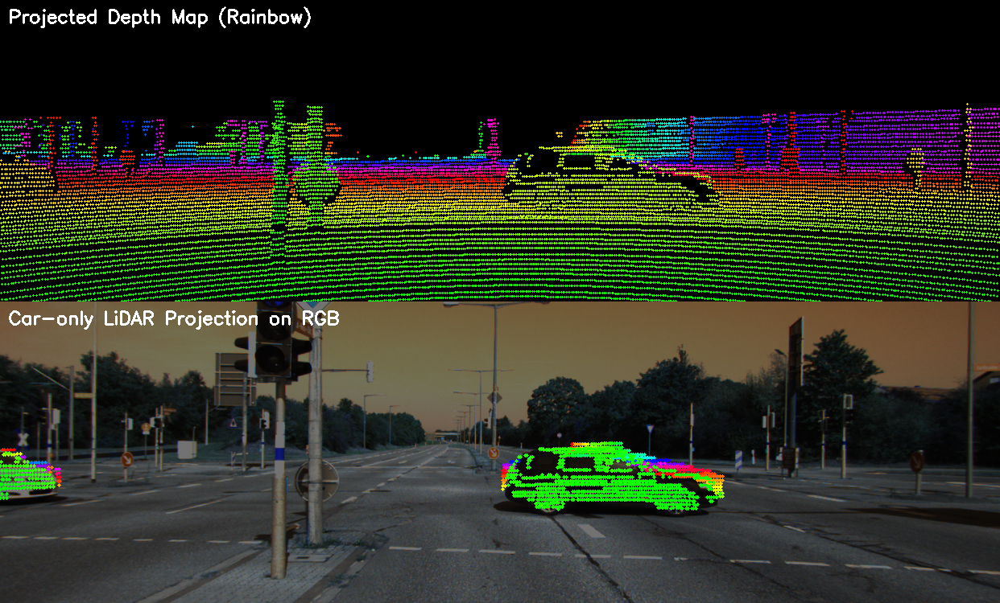

# LiDAR-Radar Sensor Fusion for 3D Object Detection Evaluation

[](https://www.python.org/)
[](https://opencv.org/)
[](https://github.com/ultralytics/ultralytics)
[](http://www.cvlibs.net/datasets/kitti/)

A comprehensive evaluation framework for 3D object detection using LiDAR-camera sensor fusion. This project combines YOLOv8 segmentation with LiDAR point cloud data to detect and evaluate cars in urban driving scenarios.

## 🚀 Features

- **Multi-modal Sensor Fusion**: Combines camera images with LiDAR point clouds
- **YOLOv8 Integration**: State-of-the-art object detection with segmentation masks
- **LiDAR Projection**: Accurate 3D-to-2D projection with depth visualization
- **BEV Visualization**: Bird's Eye View plots showing detected clusters and ground truth
- **AP Evaluation**: Average Precision calculation across multiple IoU thresholds
- **KITTI Dataset Support**: Full compatibility with KITTI object detection benchmark
- **Comprehensive Outputs**: Annotated images, projection maps, and evaluation metrics

## 📋 Table of Contents

- [Installation](#installation)
- [Dataset](#dataset)
- [Usage](#usage)
- [Configuration](#configuration)
- [Outputs](#outputs)
- [Evaluation Metrics](#evaluation-metrics)
- [Project Structure](#project-structure)
- [Dependencies](#dependencies)
- [Contributing](#contributing)
- [License](#license)

## 🛠 Installation

### Prerequisites
- Python 3.8 or higher
- Git

### Setup Steps

1. **Clone the repository**
   ```bash
   git clone https://github.com/Abhishek-Jumale/Evaluation-of-an-3D-object-detector.git
   cd Evaluation-of-an-3D-object-detector
   ```

2. **Install dependencies**
   ```bash
   pip install -r Requirement.txt
   ```

3. **Verify installation**
   ```bash
   python -c "import ultralytics; print('Ultralytics YOLO installed successfully')"
   ```

## 📊 Dataset

This project uses the **KITTI Object Detection Dataset**. The included subset contains:

- **Camera Images**: RGB images from the left camera (training set)
- **LiDAR Point Clouds**: Velodyne HDL-64E laser scanner data
- **Calibration Files**: Intrinsic/extrinsic camera-LiDAR calibration
- **Ground Truth Labels**: 3D bounding boxes for cars

### Dataset Structure
```
KITTI-Selection_incl_LiDAR_2026/
├── data_object_image_2/training/image_2/     # Camera images
├── data_object_velodyne/training/velodyne/   # LiDAR point clouds (.bin)
├── data_object_calib/training/calib/         # Calibration files
├── data_object_label_2/training/label_2/     # Ground truth labels
└── dataset_description.md                   # Dataset documentation
```

## 🚀 Usage

### Basic Execution

Run the complete evaluation pipeline:

```bash
python main.py
```

### Configuration Options

Modify the following parameters in `main.py`:

```python
# Model and detection settings
YOLO_MODEL_PATH = "yolov8n-seg.pt"  # YOLO model weights
CAR_CLASS_ID    = 2                 # COCO car class ID
CONF_THRESHOLD  = 0.18              # Detection confidence threshold
IOU_THRESHOLD   = 0.45              # NMS IoU threshold
MASK_THRESHOLD  = 0.35              # Segmentation mask threshold
MASK_DILATION   = 1                 # Mask dilation for better point assignment

# Dataset paths (adjust if needed)
BASE_PATH = r"D:\Lidar_Radar\KITTI-Selection_incl_LiDAR_2026"
```

### Advanced Usage

#### Custom Model
Replace `yolov8n-seg.pt` with a stronger model:
- `yolov8s-seg.pt` (small)
- `yolov8m-seg.pt` (medium)
- `yolov8l-seg.pt` (large)

#### Custom Dataset
Update `BASE_PATH` to point to your KITTI dataset location.

## ⚙️ Configuration

### Detection Parameters

| Parameter | Default | Description |
|-----------|---------|-------------|
| `CONF_THRESHOLD` | 0.18 | Minimum confidence for detections |
| `IOU_THRESHOLD` | 0.45 | IoU threshold for NMS |
| `MASK_THRESHOLD` | 0.35 | Segmentation mask confidence |
| `MASK_DILATION` | 1 | Morphological dilation of masks |

### Output Directories

- `Output/` - Annotated images and AP curve
- `Projection_images/` - Depth maps and LiDAR projections
- `car_detections/` - BEV plots

## 📈 Outputs

### 1. Annotated Images (`Output/`)
- Ground truth bounding boxes (red)
- YOLO detections (green)
- Confidence scores and IoU metrics

**Example Output (006227):**


### 2. Projection Images (`Projection_images/`)
- **Top**: Depth map with rainbow color coding (red=close, blue=far)
- **Bottom**: Car-only LiDAR points projected on RGB image

**Example Projection (006227):**


### 3. BEV Plots (`car_detections/`)
- All LiDAR points (gray)
- Detected car clusters (colored, with bounding rectangles)
- Ground truth 3D boxes (red wireframes)
- LiDAR origin marker

### 4. Evaluation Metrics
- Average Precision (AP) for IoU thresholds 0.50 to 0.95
- Detection statistics and summary

## 📊 Evaluation Metrics

### Average Precision (AP)

The system computes AP across multiple IoU thresholds:

```
AP@0.50: 0.723
AP@0.55: 0.689
AP@0.60: 0.645
...
AP@0.95: 0.234
```

### Key Metrics

- **Precision**: Fraction of detected objects that are correct
- **Recall**: Fraction of ground truth objects that are detected
- **IoU**: Intersection over Union between predicted and GT boxes

## 📁 Project Structure

```
├── main.py                    # Main processing script
├── projection.py              # LiDAR projection utilities
├── Requirement.txt            # Python dependencies
├── yolov8n-seg.pt            # YOLOv8 segmentation model
├── README.md                  # This file
├── KITTI-Selection_incl_LiDAR_2026/
│   ├── data_object_image_2/   # Camera images
│   ├── data_object_velodyne/  # LiDAR data
│   ├── data_object_calib/     # Calibration files
│   ├── data_object_label_2/   # Ground truth labels
│   └── dataset_description.md
├── Output/                    # Generated annotated images
├── Projection_images/         # Generated projection maps
└── car_detections/           # Generated BEV plots
```

## 📦 Dependencies

- **ultralytics>=8.0.0**: YOLOv8 implementation
- **numpy>=1.21.0**: Numerical computations
- **opencv-python>=4.5.0**: Computer vision operations
- **matplotlib>=3.5.0**: Plotting and visualization
- **openpyxl>=3.0.0**: Excel file operations (optional)

## 🤝 Contributing

1. Fork the repository
2. Create a feature branch (`git checkout -b feature/AmazingFeature`)
3. Commit your changes (`git commit -m 'Add some AmazingFeature'`)
4. Push to the branch (`git push origin feature/AmazingFeature`)
5. Open a Pull Request

## 📄 License

This project is for educational and research purposes. Please cite appropriately if used in academic work.

## 👨‍💻 Author

**Abhishek Jumale**
- GitHub: [@Abhishek-Jumale](https://github.com/Abhishek-Jumale)
- Project: [Evaluation of 3D Object Detector](https://github.com/Abhishek-Jumale/Evaluation-of-an-3D-object-detector)

## 🙏 Acknowledgments

- **KITTI Dataset**: Geiger et al. "Are we ready for Autonomous Driving? The KITTI Vision Benchmark Suite"
- **Ultralytics YOLO**: Jocher et al. "Ultralytics YOLO"
- **OpenCV Community**: Computer vision library
- **Python Scientific Stack**: NumPy, Matplotlib, SciPy

## 📞 Support

For questions or issues:
1. Check the [Issues](https://github.com/Abhishek-Jumale/Evaluation-of-an-3D-object-detector/issues) page
2. Create a new issue with detailed description
3. Include error messages and system information

---

**Happy detecting! 🚗🔍**